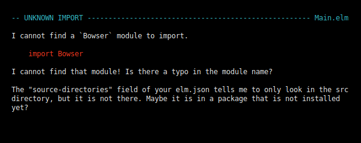

### Getting started with Elm

This blopost is a short introduction to Elm and will teach you something about Elm weird parts for beginners, decoding JSON.
who are familiar with JavaScript and node.js in order to consume data via JSON REST responses from a third party API.  

#### An short introduction to Elm 

To explain Elm in simply terms, Elm is a purely functional programming language for building web apps like Single Page Apps and other web applications.

The [Elm compiler](https://github.com/elm/compiler)  itself is implemented in [Haskell](https://en.wikipedia.org/wiki/Haskell_(programming_language)) which itself is a compiled general-purpose purely functional programming language.

Like Haskell Elm is a functional programming language and you'll never see
runtime errors running an Elm application or other [weird parts](https://github.com/denysdovhan/wtfjs) of JavaScript.

Since Elm programs can be compiled directly to JavaScript you see you have all the advantages of a pure functional programming language which makes it perfect for developing large web applications. Elm is not the only language that compiles to JavaScript there are also projects like [TypeScript](https://www.typescriptlang.org/) , [Reason](https://reasonml.github.io/) and [ClojureScript](https://clojurescript.org/) just to mention a few.

In my view one the most interesting parts is the Elm architecture which structure unlike using the latest JavaScript framework doesn't change ever. We will discuss this architecture further when we begin to write the client app.


<p align="center">

<p align="center">&copy; Daniel Stori
</p>


#### Install Elm and setup

This tutorial assumes you have Elm and all it tools setup so if you haven't you first need install Elm,
please follow the [Official Elm Introduction](https://guide.elm-lang.org/install.html) to do so.

After this you can check that Elm is installed correctly:

```elm```

And it prints:

``` Hi, thank you for trying out Elm 0.19.0. I hope you like it! ```

You're good to go. Enough talk,  lets get started to write some Elm.

#### Create a project folder

To create an client folder and and server folder run:

```mkdir -p movies/{client,server}```

Instead of using an real API we will mock an JSON Rest API with node.js by using

[https://github.com/typicode/json-server](https://github.com/typicode/json-server)

Install it by running:

``` npm install -g json-server ```

Inside the server folder create a JSON file named **movies.json** and put the following into it:

```json
{
    "movies": [{
      "title" : "The Terminator",
      "year" : 1984,
      "characters" : ["Terminator", "Kyle Reese", "Sarah Connor", "Lieutenant Ed Traxler", "Detective Hal Vukovich"],
      "director" : "James Cameron"
    },
  
    {
      "title" : "Terminator 2 - Judgement Day",
      "year" : 1991,
      "characters" : ["Terminator", "Sarah Connor", "John Connor", "T-1000", "Myles Dyson"],
      "director" : "James Cameron"
    },
  
    {
      "title" : "Terminator 3 - Rise of the Machines",
      "year": 2003,
      "characters" : ["Terminator", "John Connor", "Kate Brewster", "T-X", "Robert Brewster"],
      "director" : "Jonathan Mostow"
    },
  
    {
      "title" : "Terminator - Salvation",
      "year": 2009,
      "characters" : ["John Connor", "Marcus Wright", "Blair Williams", "Dr. Serena Kogan", "Kyle Reese"],
      "director" : "McG"
    },
  
    {
      "title" : "Terminator - Genisys",
      "year":2015,
      "characters" : ["Guardian", "Jon Connor", "Sarah Connor", "Kyle Reese", "O'Brien"],
      "director" : "Alan Taylor"
    },
  
    {
      "title" : "Terminator 6 - Terminator Reboot",
      "year":2019,
      "characters" : ["The Terminator", "Grace", "Sarah Connor", "Terminator", "Dani Ramos"],
      "director" : "Tim Miller"
    }]
  
  }
```

#### The structure of the app

As mentioned before all Elm apps are structured after the **MUV** pattern:


This **MUV** pattern is always the same across all Elm apps once you understand this  writing an complex web-app will become much easier since you can always update all components like in our client app with ease.

#### Begin the Elm App

Move to the client folder and then init the Elm project with:

``` elm init ```

Another prompt will show up asking you to move the elm.json file to direct dependencies:

```

Hello! Elm projects always start with an elm.json file. I can create them!

Now you may be wondering, what will be in this file? How do I add Elm files to
my project? How do I see it in the browser? How will my code grow? Do I need
more directories? What about tests? Etc.

Check out <https://elm-lang.org/0.19.0/init> for all the answers!

Knowing all that, would you like me to create an elm.json file now? [Y/n]:

```

Answer with yes and proceed by creating an elm.json file.

Now move on and create inside the client folder the file Main.elm:

``` touch Main.elm ```

Inside the Main.elm file put the following code in it, as you can see it is the famous hello world sample from the elm:

```elm
import Browser
import Html exposing (Html, button, div, text)
import Html.Events exposing (onClick)


main =
  Browser.sandbox { init = init, update = update, view = view }


-- MODEL

type alias Model = Int

init : Model
init =
  0


-- UPDATE

type Msg = Increment | Decrement

update : Msg -> Model -> Model
update msg model =
  case msg of
    Increment ->
      model + 1

    Decrement ->
      model - 1


-- VIEW

view : Model -> Html Msg
view model =
  div []
    [ button [ onClick Decrement ] [ text "-" ]
    , div [] [ text (String.fromInt model) ]
    , button [ onClick Increment ] [ text "+" ]
    ]
```

#### The Elm reactor

Now run the following command inside the client folder

``` elm reactor ```

Now navigate to [http://localhost:8000](http://localhost:8000)

This will open the project dashboard:


If you open the Main.elm file from the project folder this little app will show up:


If you click at the upper button the number will get lower if you click the upper button the number will get higher.

As you can see the Elm reactor compiles your Elm apps and lets you run and debug them in your the browser. This is pretty handy because if you make an error you'll get noticed and
see an pretty detailed error message  with suggestions how to correct your error.

Go now to the first line of our Main.elm file and change the following line:

```elm
import Browser
```

to 

```elm
import Bowser
```

Reload your browser and you should see the following error message:




As you  can see Elm even makes suggests that there is obviously an typo in our Main.elm file. If you ever tried to debug an Node.js application
or any other large app you will sure see the value of this.

#### What happened here exactly?

Let's dig deeper into the code of the Main.elm file to make sure you understand Elm's underlying concepts before we move on:

```elm


```


 

For now close the browser, **delete** all stuff that is in the Main.elm file and close the elm reactor by running **CTRL**+**D**

#### Starting an App to display JSON in the browser

#### Install missing dependencies

In order to run the Elm app we gonna built we need to install missing dependencies as we need to write an program to encode and decode JSON. 

If you navigate to [https://package.elm-lang.org/](https://package.elm-lang.org/) you will see all current packages provided for elm 0.19.

To decode JSON we need the package **elm/json**:

``` elm install elm/json ```

Another prompt will show up:

```

I found it in your elm.json file, but in the "indirect" dependencies.
Should I move it into "direct" dependencies for more general use? [Y/n]: 

```

Answer again with yes so you can use elm/json directly in the client app.

Now you should have a the following folders and files present in your client folder:


```
├── client
│   ├── elm.json
│   ├── Main.elm
│   └── src
└── server
    └── movies.json
```


#### Why do I need an JSON decoder?

We need to write an encode function and an decode function in order to represent the JSON data in our Elm app.

Let's just assume we have the following JSON:

```"title" : "The Terminator"```

Elm itself isN't related to JavaScript or its Objects, Elm itself represents Data as 

In order to represent this JSON data in Elm we first need to
import the elm.json.decoder from elm/json:

```elm

module Movie exposing (Movie, encode, decoder)

import Json.Decode exposing (Decoder, field, string)

titleDecoder : Decoder String
titleDecoder =

field "title" String


```

Then we need to create a Model which is a representation of the JSON Object in Elm:

```elm

type alias Movies =

{
movies : String
, title : String
, year : Int
, main_characters : String
, director : String 
}

```

Then we need the write an encode function which lets us represent the data inside the view:

```elm

encode : Movie -> E.Value
encode movie =
E.object

```

After this we go on and write the decoder function so we can represent the data in Elm:

```elm

decoder : D.Decoder Movie
decoder =
    D.map4 Movie
    (D.field "title" D.string)
    (D.field "year" D.Int)
    (D.field "main_characters" D.string)
    (D.field "director" D.string)

```

#### PROTOTYPE

```elm

module Movie exposing (Movie, encode, decoder)

import Json.Decode as D
import Json.Encode as E

type alias Movies =

{
movie : String
, title : String
, year : Int
, characters : String
, director : String
}

encode : Movie -> E.Value
encode movie =
E.object

decoder : D.Decoder Movie
decoder =
    D.map4 Movie
    (D.field "title" D.string)
    (D.field "year" D.Int)
    (D.field "characters" D.string)
    (D.field "director" D.string)

```

#### TODO Finished Elm App

``` elm

module Data.JsonValue exposing (JsonValue(..), decoder)

import movie exposing (movie)
import elm/json.decoder as Decode
    exposing
        (Decoder
        , dict
        , string
        , int
        , float
        , list
        , null
        , oneOf
        , lazy
        , map
        , bool
        )

type JsonValue
    = JsonString string
    | JsonInt Int
    | JsonFloat float
    | JsonArray (List JsonValue)
    | JsonObject (Dict String JsonValue)
    | JsonNull 

decoder : Decoder JsonValue
decoder =
    oneOf
    [ map JsonStringstring string
    , map JsonInt int 
    , map JsonFloat float
    , map JsonBoolean bool
    , list (lazy (\_ -> decoder)) |> map JsonArray
    , dict (lazy (\_ -> decoder)) |> map JsonObject
    , null JsonNull
    ]

```

#### Run the JSON Server and the Elm App:

Inside the server folder run the following command to start the JSON server:

```json-server --watch movies.json --port 5050```

Wait a second and json-server will serves our JSON file as resources under:

[http://localhost:5050/movies](http://localhost:5050/movies) 

Open this link and you should see our JSON file with values in the browser.

Now open another terminal and run elm reactor again inside the client folder:

[http://localhost:8000/Main.elm](http://localhost:8000/Main.elm)
 
Open the link and you should see your Elm app displaying the JSON file with values inside your elm-based client app.  Congrats!


#### Conclusion

This blogpost showed you how to decode JSON with Elm and created an little app to consume API calls with it.

example

If you're hooked right now I highly recommend reading:

[The Official Elm Introduction](https://guide.elm-lang.org/) 

and code through all examples in

[The Elm Architecture](https://guide.elm-lang.org/architecture/)

If you  want to know more about JSON decoders and Evan Czaplicki's vision of Elm's of data interchange in Elm you can read more about it here:

[https://gist.github.com/evancz/1c5f2cf34939336ecb79b97bb89d9da6](https://gist.github.com/evancz/1c5f2cf34939336ecb79b97bb89d9da6)


I hope you enjoyed reading it if so feel free to follow me on [GitHub](https://github.com/nfuhs) or [Twitter](https://twitter.com/NorbertFuhs)

If you have any questions left just post an issue in the blogpost repo:

[https://github.com/nfuhs/get-started-elm](https://github.com/nfuhs/get-started-elm)