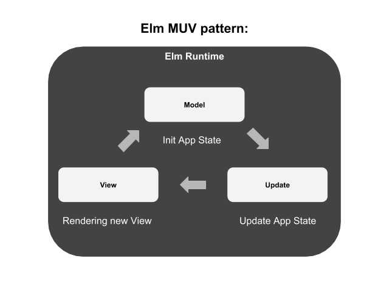

### Get started with Elm

This is the source code for my Elm beginner tutorial how to get started with learning Elm and decode JSON with it to consume an API because this is usally the first step if you want to write an Single Page Application.

#### An short introduction to Elm 

Elm was created by Evan Czaplicki as his [thesis](https://www.seas.harvard.edu/sites/default/files/files/archived/Czaplicki.pdf) in 2012, Elm is a purely functional programming language for building web applications.

In my view one the most interesting points is the Elm Architecture:



This MUV pattern is always the same across all Elm apps once you understand this things like writing an SPA with elm will become very ease with Elm.

This is really a straightfoward concept in Elm and pretty similar to other reactive concepts like Facebook's [React](https://reactjs.org/) for example.

#### Install Elm and setup

This tutorial asumes you have Elm and all it tools setup so if you haven't you first need install Elm,
please follow the [Official Elm Introduction](https://guide.elm-lang.org/install.html) to do so.

#### Check Elm is intalled correctly

When you type:

```elm```

And it prints:

``` Hi, thank you for trying out Elm 0.19.0. I hope you like it! ```

You're good to go. Enough talk,  lets get started to write some Elm,
in this short tutorial we're gonna decode some JSON API calls and later turn this into an little app.

#### Install missing dependencies

In order to run the Elm example app we're gonna built we need to install missing dependencies.

If you navigate to [https://package.elm-lang.org/](https://package.elm-lang.org/) you will see all current
packages provide for elm 0.19.
if you run

``` elm package install elm/json ```


#### What we gonna build?

``` elm 

import Browser
import Html exposing (Html, button, div, text)
import Html.Events exposing (onClick)


main =
  Browser.sandbox { init = init, update = update, view = view }


-- MODEL

type alias Model = Int

init : Model
init =
  0


-- UPDATE

type Msg = Increment | Decrement

update : Msg -> Model -> Model
update msg model =
  case msg of
    Increment ->
      model + 1

    Decrement ->
      model - 1


-- VIEW

view : Model -> Html Msg
view model =
  div []
    [ button [ onClick Decrement ] [ text "-" ]
    , div [] [ text (String.fromInt model) ]
    , button [ onClick Increment ] [ text "+" ]
]

```

#### Conclusion

You learned how decode JSON with Elm and created an little app to consume API calls
with it.

If you're hooked right now I highly recommend reading and coding true the
[Official Elm Introduction](https://guide.elm-lang.org/) and code trough all examples in [The Elm Architecture](The Elm Architecture).


