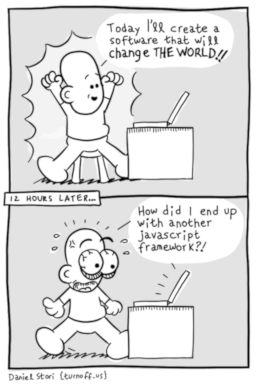
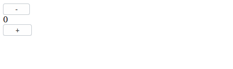
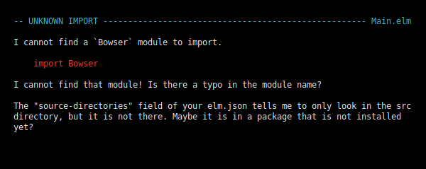
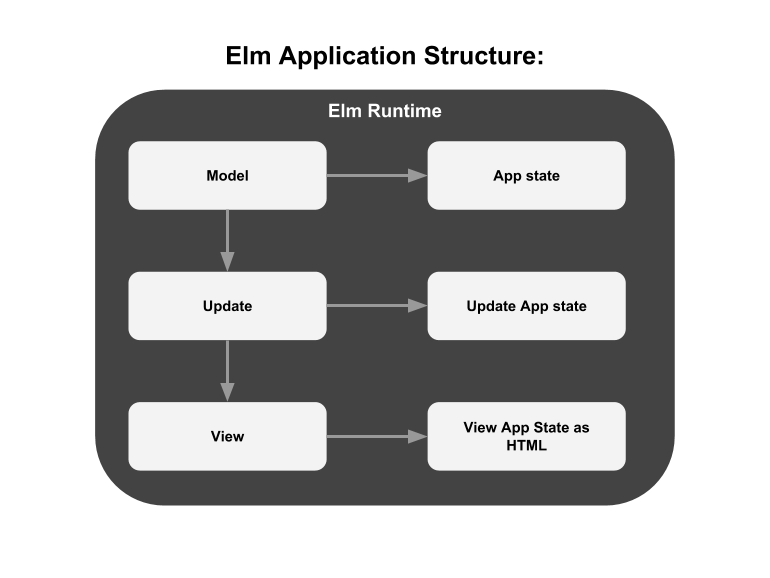

## Getting started with Elm

This blog post will give you a short introduction to Elm and will teach you about the main parts and tools you use to build an app with Elm. 

#### An short introduction to Elm 

To explain Elm in simply terms, Elm is a purely functional programming language for building web apps like Single Page Apps and other web applications. The [Elm compiler](https://github.com/elm/compiler)  itself is implemented in [Haskell](https://en.wikipedia.org/wiki/Haskell_(programming_language)) which itself is a compiled general-purpose purely functional programming language. Like Haskell Elm is a functional programming language and you'll never see
runtime errors running an Elm application or other [weird parts](https://github.com/denysdovhan/wtfjs) of JavaScript.

Since Elm programs can be compiled directly to JavaScript you see you have all the advantages of a pure functional programming language which makes it perfect for developing large web applications. Elm is not the only language that compiles to JavaScript there are also projects like [TypeScript](https://www.typescriptlang.org/) , [Reason](https://reasonml.github.io/) and [ClojureScript](https://clojurescript.org/) just to mention a few.

In my view one the most interesting parts is the Elm architecture which structure unlike using the latest JavaScript framework doesn't change ever. We will discuss this architecture further when we begin to take a look at an typical Elm app in this short tutorial.


<p align="center">

<p align="center">&copy; Daniel Stori
</p>


#### Install Elm and setup

This tutorial assumes you have Elm and all it tools setup so if you haven't you first need install Elm,
please follow the [Official Elm Introduction](https://guide.elm-lang.org/install.html) to do so.

After this you can check that Elm is installed correctly:

```elm```

And it prints:

``` Hi, thank you for trying out Elm 0.19.0. I hope you like it! ```

You're good to go. Enough talk,  lets get started to write some Elm.


#### Begin the Elm App

Move to the client folder and then init the Elm project with:

``` elm init ```

Another prompt will show up asking you to move the elm.json file to direct dependencies:

```

Hello! Elm projects always start with an elm.json file. I can create them!

Now you may be wondering, what will be in this file? How do I add Elm files to
my project? How do I see it in the browser? How will my code grow? Do I need
more directories? What about tests? Etc.

Check out <https://elm-lang.org/0.19.0/init> for all the answers!

Knowing all that, would you like me to create an elm.json file now? [Y/n]:

```

Answer with yes and proceed by creating an elm.json file.

Now move on and create inside the client folder the file Main.elm:

``` touch Main.elm ```

You should now have the following folder structure inside your project folder:

```

├── elm.json
├── Main.elm
└── src

```

Open the Main.elm file and put the following code in it:

```elm
import Browser
import Html exposing (Html, button, div, text)
import Html.Events exposing (onClick)


main =
  Browser.sandbox { init = init, update = update, view = view }


-- MODEL

type alias Model = Int

init : Model
init =
  0


-- UPDATE

type Msg = Increment | Decrement

update : Msg -> Model -> Model
update msg model =
  case msg of
    Increment ->
      model + 1

    Decrement ->
      model - 1


-- VIEW

view : Model -> Html Msg
view model =
  div []
    [ button [ onClick Decrement ] [ text "-" ]
    , div [] [ text (String.fromInt model) ]
    , button [ onClick Increment ] [ text "+" ]
    ]
```

Now save the file and stay inside your projects folder. 

#### The Elm reactor

Now run the following command inside the client folder

``` elm reactor ```

Now navigate to [http://localhost:8000](http://localhost:8000)

This will open the project dashboard:


If you open the Main.elm file from the project folder this little app will show up:



If you click at the minus button the number will get lower if you click the plus button the number will get higher.

As you can see the Elm reactor compiles your Elm apps and lets you run and debug them in your the browser. This is pretty handy because if you make an error you'll get noticed and see an pretty detailed error message  with suggestions how to correct your error.

Go now to the first line of our Main.elm file and change the following line:

```elm
import Browser
```

to 

```elm
import Bowser
```

Reload your browser and you should see the following error message:




As you  can see Elm even suggests that there is obviously an typo in our Main.elm file. If you ever tried to debug an Node.js application
or any other large app you will sure see the value of this.

#### What happened here exactly?

Let's dig deeper into the code of the Main.elm file to make sure you understand Elm's underlying concepts before we move on:

#### The structure of an Elm app

Elm apps are structured after the **MUV** pattern:



This **MUV** pattern is always the same across all Elm apps once you understand this writing an complex web-app will become much easier since you can always update all components like in our app with ease.


```elm
import Browser
import Html exposing (Html, button, div, text)
import Html.Events exposing (onClick)
```

At the first few lines we see what we would expect at any other programming language like for example Python we import the needed Elm packages to run this basic app, elm/Browser and HTML are included in Elm's standard packages so we can use them directly.


If you look closely you'll notice all the elements we use in the elm example after exposing

```elm
main =
  Browser.sandbox { init = init, update = update, view = view }
```

Browser.sandbox is required to run our app inside the browser an sandbox takes care that our program can only run inside the browser and not communicate with the outside world.Lets concentrate more on the underlying parts inside our Elm app.

The main is the entry point of every Elm program and has beside Browser.sandbox an quiet interesting part in it:

``` { init = init, update = update, view = view } ```

This is basically the control-flow of our Elm app. The init function initializes the Model , the Update function Updates our Model and the View if something changes in our app state and
the view defines how our data will be displayed in the browser.  

#### The M in MUV

```elm
-- MODEL

type alias Model = Int

init : Model
init =
  0
```

Here we define the Model of our app and as you can see we use an type alias here but why do we need an type alias you ask? As mentioned earlier 

#### The U in MUV

```elm
-- UPDATE

type Msg = Increment | Decrement

update : Msg -> Model -> Model
update msg model =
  case msg of
    Increment ->
      model + 1

    Decrement ->
      model - 1
```

Elm programs share their state by sending messages via functions you may heard about the term [Message Passing](https://en.wikipedia.org/wiki/Message_passing) in Object oriented programming languages like Java and C# or the [The Actor Model](https://en.wikipedia.org/wiki/Actor_model) used by other functional programming languages like Erlang.

##### The V in MUV

```elm
-- VIEW

view : Model -> Html Msg
view model =
  div []
    [ button [ onClick Decrement ] [ text "-" ]
    , div [] [ text (String.fromInt model) ]
    , button [ onClick Increment ] [ text "+" ]
    ]
```

View model defines our content which should be displayed in the browser and as you can see also takes our functions Decrement and Increment and send it back  to the update function,
which then updates our model and sends the state back to view. 

This is the basic

#### How do I run my Elm app as a normal web app?

Since we want to run our basic app just as a normal web page we need to translate our Main.elm into an ordinary JavaScript app.

Move into your src director and create an index.html file in it.

``` index.html ```

The put the following HTML inside it:
```HTML

```

#### Running Elm make

``` elm make Main.elm --output=main.html ```

#### Conclusion

This blog post gave you an short introduction to Elm in the next part we will take a look further at on of the weird parts in Elm and learn how we decode JSON with it.

If you're hooked right now I highly recommend reading:

[The Official Elm Introduction](https://guide.elm-lang.org/) 

and code through all examples in

[The Elm Architecture](https://guide.elm-lang.org/architecture/)

I hope you enjoyed reading it if so feel free to follow me on [GitHub](https://github.com/nfuhs) or [Twitter](https://twitter.com/NorbertFuhs)

If you have any questions left just post an issue in this repository:

[https://github.com/nfuhs/get-started-elm](https://github.com/nfuhs/get-started-elm)