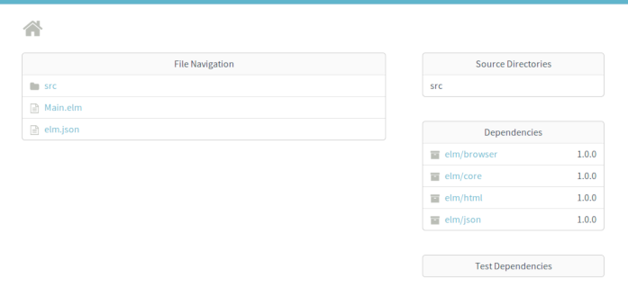

## Getting started with Elm

This blog post will give you a short introduction to Elm and will teach you about the main parts and tools you use to build an app with Elm. 

#### An short introduction to Elm 

To explain Elm in simply terms, Elm is a purely functional programming language for building web apps like Single Page Apps and other web applications. The [Elm compiler](https://github.com/elm/compiler)  itself is implemented in [Haskell](https://en.wikipedia.org/wiki/Haskell_(programming_language)) which itself is a compiled general-purpose purely functional programming language. Like Haskell Elm is a functional programming language and you'll never see
runtime errors running an Elm application or other [weird parts](https://github.com/denysdovhan/wtfjs) of JavaScript.

Since Elm programs can be compiled directly to JavaScript you see you have all the advantages of a pure functional programming language which makes it perfect for developing large web applications. Elm is not the only language that compiles to JavaScript there are also projects like [TypeScript](https://www.typescriptlang.org/) , [Reason](https://reasonml.github.io/) and [ClojureScript](https://clojurescript.org/) just to mention a few.

In my view one the most interesting parts is the Elm architecture which structure unlike using the latest JavaScript framework doesn't change ever. We will discuss this architecture further when we begin to take a look at an typical Elm app in this short tutorial.


<p align="center">

<p align="center">&copy; Daniel Stori
</p>


#### Install Elm and setup

This tutorial assumes you have Elm and all it tools setup so if you haven't you first need install Elm,
please follow the [Official Elm Introduction](https://guide.elm-lang.org/install.html) to do so.

After this you can check that Elm is installed correctly:

```elm```

And it prints:

``` Hi, thank you for trying out Elm 0.19.0. I hope you like it! ```

You're good to go. Enough talk,  lets get started to write some Elm.


#### Begin the Elm App

Create a project folder named elm-app and run following command in it

``` elm init ```

Another prompt will show up asking you to move the elm.json file to direct dependencies:

```

Hello! Elm projects always start with an elm.json file. I can create them!

Now you may be wondering, what will be in this file? How do I add Elm files to
my project? How do I see it in the browser? How will my code grow? Do I need
more directories? What about tests? Etc.

Check out <https://elm-lang.org/0.19.0/init> for all the answers!

Knowing all that, would you like me to create an elm.json file now? [Y/n]:

```

Answer with yes and proceed by creating an elm.json file.

Now move on and create inside the client folder the file Main.elm:

``` touch Main.elm ```

You should now have the following folder structure inside your elm-app folder:

```

├── elm.json
├── Main.elm
└── src

```

Open the Main.elm file and put the following code in it:

```elm
import Browser
import Html exposing (Html, button, div, text)
import Html.Events exposing (onClick)


main =
  Browser.sandbox { init = init, update = update, view = view }


-- MODEL

type alias Model = Int

init : Model
init =
  0


-- UPDATE

type Msg = Increment | Decrement

update : Msg -> Model -> Model
update msg model =
  case msg of
    Increment ->
      model + 1

    Decrement ->
      model - 1


-- VIEW

view : Model -> Html Msg
view model =
  div []
    [ button [ onClick Decrement ] [ text "-" ]
    , div [] [ text (String.fromInt model) ]
    , button [ onClick Increment ] [ text "+" ]
    ]
```

Now save the file and stay inside your elm-app folder. 

#### The Elm reactor

Now run:

``` elm reactor ```

Now navigate to [http://localhost:8000](http://localhost:8000)

This will open the project dashboard:



If you open the Main.elm file from the project folder this little app will show up:


If you click at the minus button the number will get lower if you click the plus button the number will get higher.

As you can see the Elm reactor compiles your Elm apps and lets you run and debug them in your the browser. This is pretty handy because if you make an error you'll get noticed and see an pretty detailed error message  with suggestions how to correct your error.

Go now to the first line of our Main.elm file and change the following line:

```elm
import Browser
```

to 

```elm
import Bowser
```

Reload your browser and you should see the following error message:


As you  can see Elm even suggests that there is obviously an typo in our Main.elm file. If you ever tried to debug an Node.js application
or any other large app you will sure see the value of this.

#### The structure of an Elm app

```elm
import Browser
import Html exposing (Html, button, div, text)
import Html.Events exposing (onClick)
```

At the first few lines we see what we would expect at any other programming language like for example Python we import the needed Elm packages to run this basic app, elm/Browser and HTML are included in Elm's standard packages so we can use them directly.


If you look closely you'll notice all the elements we use in the elm example after exposing

```elm
main =
  Browser.sandbox { init = init, update = update, view = view }
```

Browser.sandbox is required to run our app inside the browser and sandbox takes care that our program can only run inside the browser and not communicate with the outside world.

The main is the entry point of every Elm program and has beside Browser.sandbox an quiet interesting part in it:

``` { init = init, update = update, view = view } ```

This is basically the control-flow of our Elm app. The init function initializes the Model , the update function updates our Model and the View
component will be re-rendered if our app state changes as  you see Elm apps are structured after the **MUV** pattern:


This **MUV** pattern is always the same across all Elm apps once you understand this writing an complex web-app will become much easier since you can always update all components like in our app with ease.

#### The M in MUV

```elm
-- MODEL

type alias Model = Int

init : Model
init =
  0
```

Here we define the Model of our app and define an type alias for it.
In Elm a Type alias is just a shorter variable for it with Model if we want to make variables accessible and init the Model with 0.

#### The U in MUV

```elm
-- UPDATE

type Msg = Increment | Decrement

update : Msg -> Model -> Model
update msg model =
  case msg of
    Increment ->
      model + 1

    Decrement ->
      model - 1
```

Here we implement the update part of our Elm app.
Since we just want to update the value of our previously defined Model we just send Message to it if the Increment and Decrement change.

##### The V in MUV

```elm
-- VIEW

view : Model -> Html Msg
view model =
  div []
    [ button [ onClick Decrement ] [ text "-" ]
    , div [] [ text (String.fromInt model) ]
    , button [ onClick Increment ] [ text "+" ]
    ]
```

The View part sends an direct Msg from the Html button to Increment or Decrement our value in the Model.

#### How do I run my Elm app as a normal web app?

Since we want to run our basic app just as a normal web page we need to translate our Main.elm into an ordinary Node.js based app.

In order to run our app we first need to install [Parcel](https://parceljs.org/) with:

``` npm install -g parcel-bundler ```


Inside our elm-app folder we first need the content inside our elm.json file to this:

```JSON
{
    "type": "application",
    "source-directories": [
        "."
    ],
    "elm-version": "0.19.0",
    "dependencies": {
        "direct": {
            "elm/browser": "1.0.0",
            "elm/core": "1.0.0",
            "elm/html": "1.0.0"
        },
        "indirect": {
            "elm/json": "1.0.0",
            "elm/time": "1.0.0",
            "elm/url": "1.0.0",
            "elm/virtual-dom": "1.0.0"
        }
    },
    "test-dependencies": {
        "direct": {},
        "indirect": {}
    }
}
```

Move inside your src folder and create an index.html file and put the following code in it:

```html
<html>
<body>
  <div id="app"></div>
  <script src="./index.js"></script>
</body>
</html>
```

Then create an index.js file with:

```JavaScript
var { Elm } = require("./Main.elm");

Elm.Main.init({
  node: document.getElementById("app")
});
```

The last thing we do is creating an package.json file to load and install our needed dependencies:

```JSON
{
  "private": true,
  "scripts": {
    "start": "parcel index.html"
  },
  "devDependencies": {
    "node-elm-compiler": "^5.0.1",
    "parcel-bundler": "^1.10.1"
  }
}
```

Now run:

``` npm install ```

Wait a moment and open your node.js  served Elm app under:

[localhost:1234](localhost:1234)

#### Conclusion

This blog post gave you an short introduction to Elm in the next part we will take a look further at the weird parts in Elm and learn how we decode JSON with it.

If you're hooked right now I highly recommend reading:

[The Official Elm Introduction](https://guide.elm-lang.org/) 

and code through all examples in

[The Elm Architecture](https://guide.elm-lang.org/architecture/)

I hope you enjoyed reading it if so feel free to follow me on [GitHub](https://github.com/nfuhs) or [Twitter](https://twitter.com/NorbertFuhs)

If you have any questions left just post an issue in this repository:

[https://github.com/nfuhs/get-started-elm](https://github.com/nfuhs/get-started-elm)