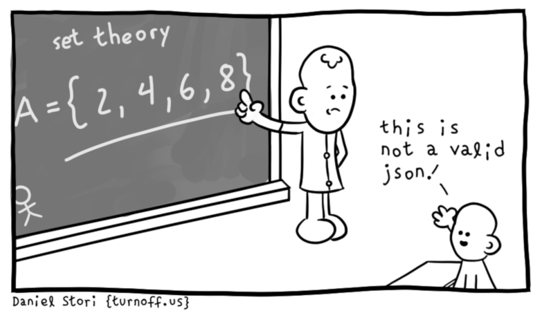

### Getting started with Elm Part 2: Writing an JSON decoder in Elm

In [part one](https://functional.works-hub.com/learn/getting-started-with-elm-4c6bc) we got a short an look at [Elm](https://elm-lang.org/) this part will give you an introduction of one of the parts which I think is hard to understand for Elm beginners decoding [JSON](https://www.json.org/). JSON is by far the most popular data interchange format and since Elm is based on [Haskell](https://www.haskell.org/) instead of JavaScript you need to write an JSON decoder in order to represent the data in Elm. 

<p align="center">

<p align="center">&copy; Daniel Stori
</p>


#### Basic JSON parsing in Node.js

Coming from JavaScript or Node.js you are used to run JSON.parse directly :

```JavaScript

var movies = '{"title" : "The Terminator"}';

// parse JSON value into an JavaScript object

var obj = JSON.parse(movies);

// access the object property string 

console.log(obj.title);

//=> "The Terminator"

```

Let's just assume we have an file called movies.json and you would like to display the values with another programming language like [Go](https://golang.org/) for example:

```Go

package main

import (
	"encoding/json"
	"fmt"
	"os"
)

type Movies struct {
	Title string
}

func main() {

	file, _ := os.Open("movies.json")
	defer file.Close()
	decoder := json.NewDecoder(file)
	movies := Movies{}
	err := decoder.Decode(&movies)
	if err != nil {
		fmt.Println("error:", err)
	}

	fmt.Println(movies.Title)
}

```

As you can see in an strong-typed programming language like Go we have no native JavaScript objects. We need to define a struct first which holds our JSON values and provides an type definition. I choose Go as example here because as Elm it is an strongly typed programming language. Another interesting point is that we need to import the encoding/json package from Go's standard library and run an JSON decoder function. 

Before you move on to write your own JSON decoder to be used in the Elm client app we will first create some sample JSON data to feed our app with. 

To archive this we will simulate an server with Node.js which will serve our data as a file called movies.json.

#### Create an client and server folder

First create an client folder server folder by running:

```mkdir -p movies/{client,server}```

Now install the node.js package we will be using as our JSON server:

[https://github.com/typicode/json-server](https://github.com/typicode/json-server)

Install it by running:

``` npm install -g json-server ```

Inside the server folder create a JSON file named **movies.json** and put the following content to it:

```json
{
    "movies": [{
      "title" : "The Terminator",
      "year" : 1984,
      "characters" : ["Terminator", "Kyle Reese", "Sarah Connor", "Lieutenant Ed Traxler", "Detective Hal Vukovich"],
      "director" : "James Cameron"
    },
  
    {
      "title" : "Terminator 2 - Judgement Day",
      "year" : 1991,
      "characters" : ["Terminator", "Sarah Connor", "John Connor", "T-1000", "Myles Dyson"],
      "director" : "James Cameron"
    },
  
    {
      "title" : "Terminator 3 - Rise of the Machines",
      "year": 2003,
      "characters" : ["Terminator", "John Connor", "Kate Brewster", "T-X", "Robert Brewster"],
      "director" : "Jonathan Mostow"
    },
  
    {
      "title" : "Terminator - Salvation",
      "year": 2009,
      "characters" : ["John Connor", "Marcus Wright", "Blair Williams", "Dr. Serena Kogan", "Kyle Reese"],
      "director" : "McG"
    },
  
    {
      "title" : "Terminator - Genisys",
      "year":2015,
      "characters" : ["Guardian", "Jon Connor", "Sarah Connor", "Kyle Reese", "O'Brien"],
      "director" : "Alan Taylor"
    },
  
    {
      "title" : "Terminator 6 - Terminator Reboot",
      "year":2019,
      "characters" : ["The Terminator", "Grace", "Sarah Connor", "Terminator", "Dani Ramos"],
      "director" : "Tim Miller"
    }]
  
  }
```

#### Install missing Elm packages

In order to decode JSON with your Elm app you need to install the Elm package **elm/json**:

``` elm install elm/json ```

Another prompt will show up:

```

I found it in your elm.json file, but in the "indirect" dependencies.
Should I move it into "direct" dependencies for more general use? [Y/n]: 

```
Answer with yes so you can use the elm/json package directly in the Elm app. Now you should have a the following folders and files present in your project folder:

```

├── client
│   ├── elm.json
│   ├── Main.elm
│   └── src
└── server
    └── movies.json

```

#### Basic sample of an JSON decoder in Elm

```elm

module Movie exposing (Movie, encode, decoder)

import Json.Decode exposing (Decoder, field, string)

titleDecoder : Decoder String
titleDecoder =

field "title" String

```

First you need to create a Model which represents your JSON data in Elm :

#### TODO ELM CODE-JSON-1

Then you need the write the decode function which lets you use the data inside the view:

#### TODO ELM CODE-JSON-2

After this go on and write the decoder function so we can represent the data in Elm:

#### TODO ELM CODE-JSON-3

#### TODO ELM CODE-HTTP-INTRO

#### TODO FINISHED ELM APP 

``` elm

module main exposing (data, encode, decoder)

import Json.Decode as D
import Json.Encode as E

-- JSON DATA

type alias Data =
{ title: String
, year: Int
, characters : String
, director : String
}

-- ENCODE

encode : data -> E.Value
encode cause =
    E.object
    [("title", E.string data.title)
    ,("year", E.Int data.year)
    ,("characters", E.string data.characters)
    ,("director", E.string data.director)
    ]

-- DECODER

decoder : D.Decoder Data
decoder =
    D.map4 Data
    (D.field "title" D.string)
    (D.field "year" D.int)
    (D.field "characters", D.string)
    (D.field "director", D.string)

```

#### Run JSON Server and Elm App:

Inside the server folder run the following command to start JSON server:

``` json-server --watch movies.json --port 5050 ```

Wait a second and the json-server will serve our JSON file as resources under:

[http://localhost:5050/movies](http://localhost:5050/movies)

Open this link and you should see our JSON file with values in the browser.

Now switch inside the client folder and run:

``` elm-reactor ```

An prompt will show up to inform you that your Elm app is running open the following link:

[http://localhost:8000/](http://localhost:8000/)

Inside the File Navigation open the **Main.elm** file now you should see your Elm app displaying the JSON file with values inside your elm-based client app.

#### Conclusion

I hope you enjoyed reading part two if you liked it feel free to follow me on [GitHub](https://github.com/nfuhs) or [Twitter](https://twitter.com/NorbertFuhs) if you have any questions just post an issue to this repo:

[https://github.com/nfuhs/get-started-elm](https://github.com/nfuhs/get-started-elm)